# Industrial Machine Failure Prediction — AI4I 2020

An end-to-end machine learning project for predicting whether an industrial machine observation is associated with **machine failure**, using the **AI4I 2020 Predictive Maintenance Dataset**.

The project focuses on a practical, leakage-aware classification workflow rather than an unnecessarily complex deployment stack.

---

## Project Overview

Predictive maintenance aims to identify machine operating conditions associated with failure so that maintenance can be planned before costly downtime occurs.

This project answers:

> **Can machine operating conditions be used to distinguish observations associated with machine failure from observations associated with no failure?**

The pipeline covers:

- Data quality auditing
- Exploratory Data Analysis (EDA)
- Leakage analysis
- Feature engineering
- Train/test splitting
- Numerical and categorical preprocessing
- Six machine learning models
- Hyperparameter tuning with `GridSearchCV`
- Imbalanced-class evaluation
- Confusion matrix analysis
- ROC and Precision-Recall curves
- Decision-threshold analysis
- Feature importance
- False-positive / false-negative analysis

---

## Dataset

The project uses the **AI4I 2020 Predictive Maintenance Dataset**.

- **10,000 observations**
- **14 original columns**
- No missing values in the uploaded dataset
- No duplicate rows in the uploaded dataset
- Target: `Machine failure`
- `0` → No Failure
- `1` → Failure

### Dataset sources

- Kaggle: https://www.kaggle.com/datasets/stephanmatzka/predictive-maintenance-dataset-ai4i-2020
- UCI Machine Learning Repository: https://archive.ics.uci.edu/dataset/601/ai4i

The dataset is included under `data/ai4i2020.csv` for convenience. Please retain the original dataset attribution when redistributing the repository.

---

## Repository Structure

```text
AI4I-Predictive-Maintenance/
│
├── README.md
├── requirements.txt
├── .gitignore
├── Aditya_Machine_Failure.ipynb
│
├── data/
│   └── ai4i2020.csv
│
└── figures/
    ├── target_distribution.png
    ├── failure_rate_by_type.png
    ├── correlation_heatmap.png
    ├── tool_wear_distribution.png
    ├── engineered_features.png
    ├── confusion_matrix.png
    ├── normalized_confusion_matrix.png
    ├── roc_curve.png
    ├── precision_recall_curve.png
    ├── probability_distribution.png
    ├── threshold_analysis.png
    └── feature_importance.png
```

---

## Machine Learning Workflow

```text
AI4I 2020 Dataset
        │
        ▼
Data Quality Audit
        │
        ▼
Exploratory Data Analysis
        │
        ▼
Leakage Check
        │
        ▼
Feature Engineering
        │
        ▼
Train / Test Split
        │
        ▼
Preprocessing Pipeline
        │
        ▼
Six ML Models
        │
        ▼
GridSearchCV
        │
        ▼
Model Comparison
        │
        ▼
Detailed Evaluation
        │
        ▼
Failure Prediction
```

---

## Exploratory Data Analysis

### Machine Failure Distribution

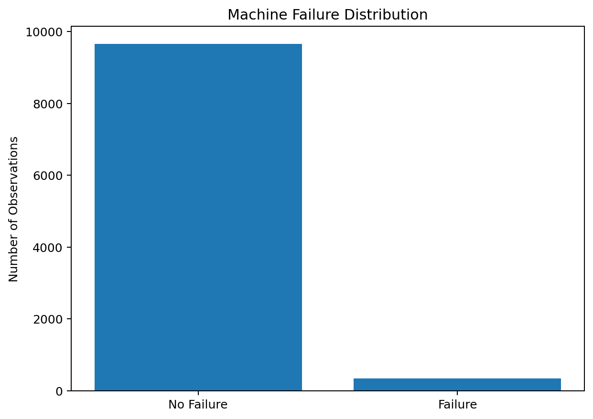

The target is imbalanced: machine failures are much less frequent than normal observations. Therefore, accuracy alone is not sufficient for judging the model.

### Failure Rate by Product Type


### Correlation Analysis

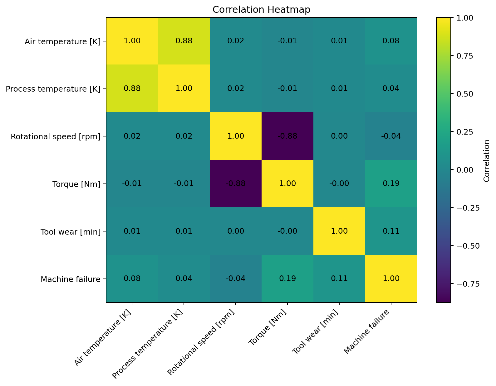

### Tool Wear Analysis

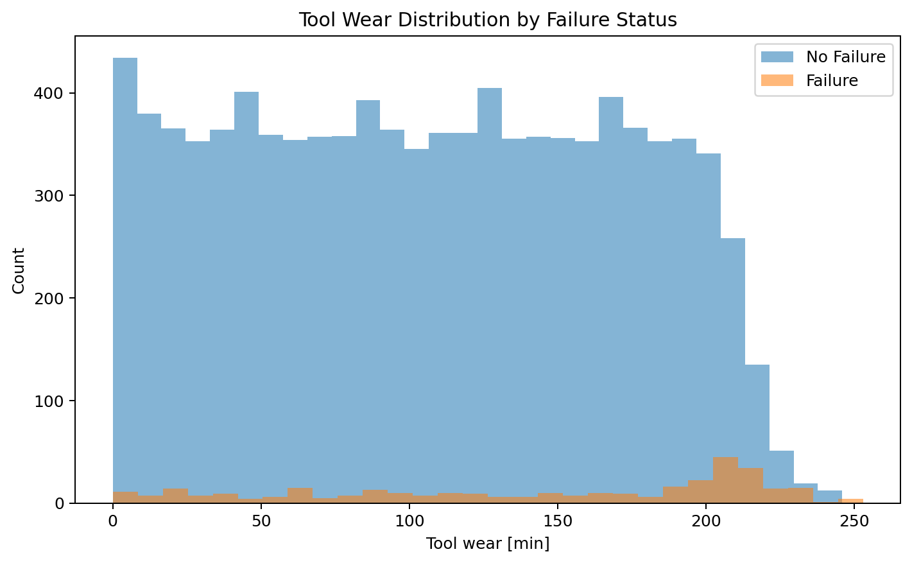

---

## Feature Engineering

Four additional features were created from the available operating conditions:

### 1. Temperature Difference

```text
Process temperature - Air temperature
```

This captures the thermal gap between the process and surrounding air.

### 2. Mechanical Power

```text
Torque × Angular Velocity
```

with RPM converted to radians/second.

### 3. Torque per Speed

```text
Torque / Rotational Speed
```

A simple representation of the relationship between mechanical load and rotational speed.

### 4. Thermal Wear Load

```text
Temperature Difference × Tool Wear
```

This combines thermal conditions with accumulated tool wear.

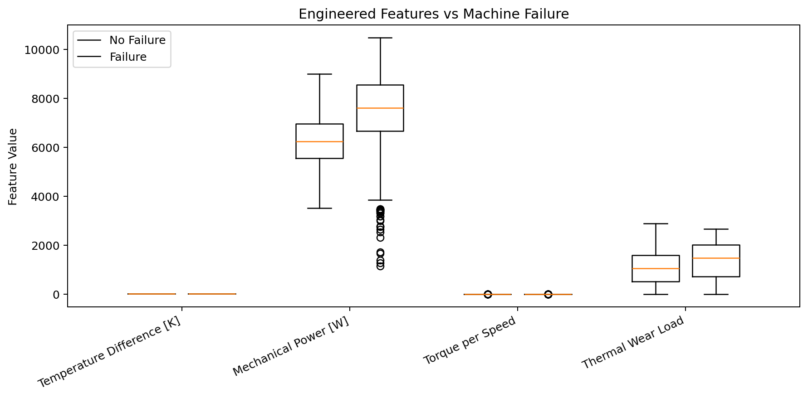

---

## Leakage Prevention

The following columns are deliberately excluded from predictive features:

| Column | Reason |
|---|---|
| `UDI` | Identifier |
| `Product ID` | Identifier |
| `Machine failure` | Target |
| `TWF` | Failure-mode indicator |
| `HDF` | Failure-mode indicator |
| `PWF` | Failure-mode indicator |
| `OSF` | Failure-mode indicator |
| `RNF` | Failure-mode indicator |

The failure-mode indicators can directly reveal information about the target, so keeping them would make the model unrealistically strong and introduce target leakage.

The model instead learns from:

- Product type
- Air temperature
- Process temperature
- Rotational speed
- Torque
- Tool wear
- Temperature difference
- Mechanical power
- Torque/speed relationship
- Thermal-wear load

---

## Models Compared

The notebook evaluates six practical classification models:

1. Logistic Regression
2. Decision Tree
3. Random Forest
4. Gradient Boosting
5. XGBoost
6. Support Vector Machine (SVM)

Each model is tuned using **5-fold Stratified Cross-Validation** and `GridSearchCV`.

The primary tuning metric is **F1 score**, because the failure class is the minority class.

---

## Final XGBoost Evaluation

The final evaluation shown in the notebook gives:

| Metric | Score |
|---|---:|
| Accuracy | 0.9900 |
| Balanced Accuracy | 0.8955 |
| Precision | 0.9000 |
| Recall | 0.7941 |
| F1 Score | 0.8438 |
| Specificity | 0.9969 |
| ROC-AUC | 0.9843 |
| PR-AUC | 0.8856 |

### Confusion Matrix

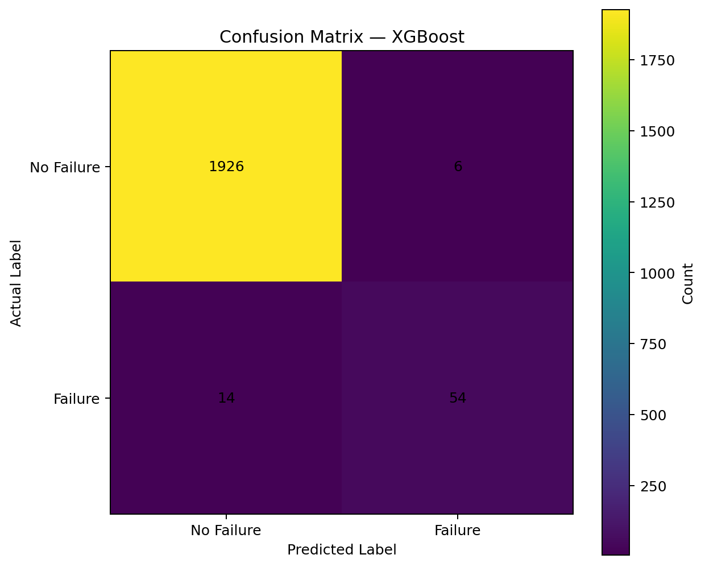

The final confusion matrix is:

| | Predicted No Failure | Predicted Failure |
|---|---:|---:|
| **Actual No Failure** | **1926** | **6** |
| **Actual Failure** | **14** | **54** |

This means:

- **TN = 1926** — healthy observations correctly identified
- **FP = 6** — healthy observations incorrectly flagged as failures
- **FN = 14** — actual failures missed by the model
- **TP = 54** — actual failures correctly detected

For predictive maintenance, **false negatives are particularly important**, because they represent failures that the model did not detect.

### Normalized Confusion Matrix

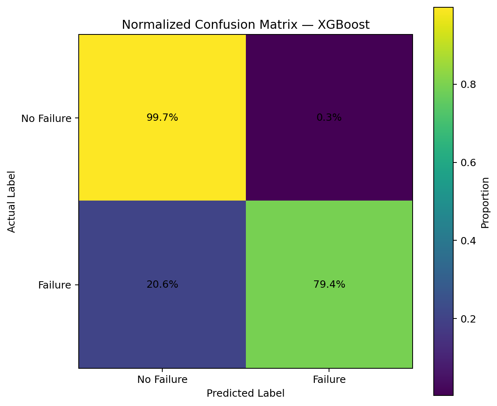

---

## ROC Curve

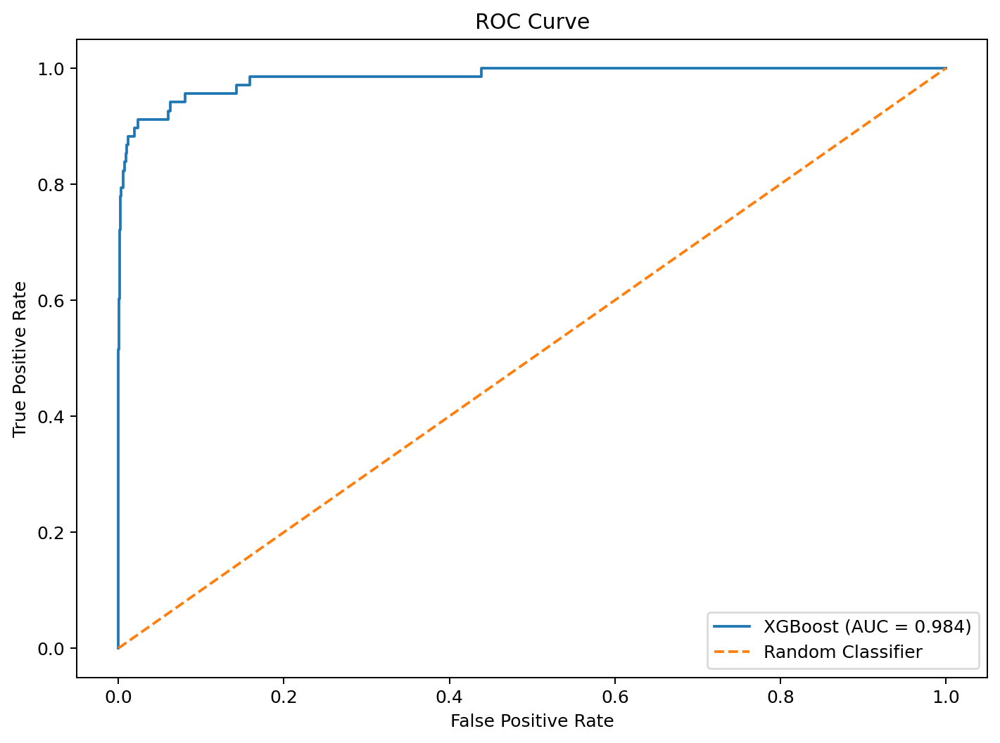

The ROC curve evaluates the model across different classification thresholds.

**ROC-AUC = 0.9843**

---

## Precision-Recall Curve

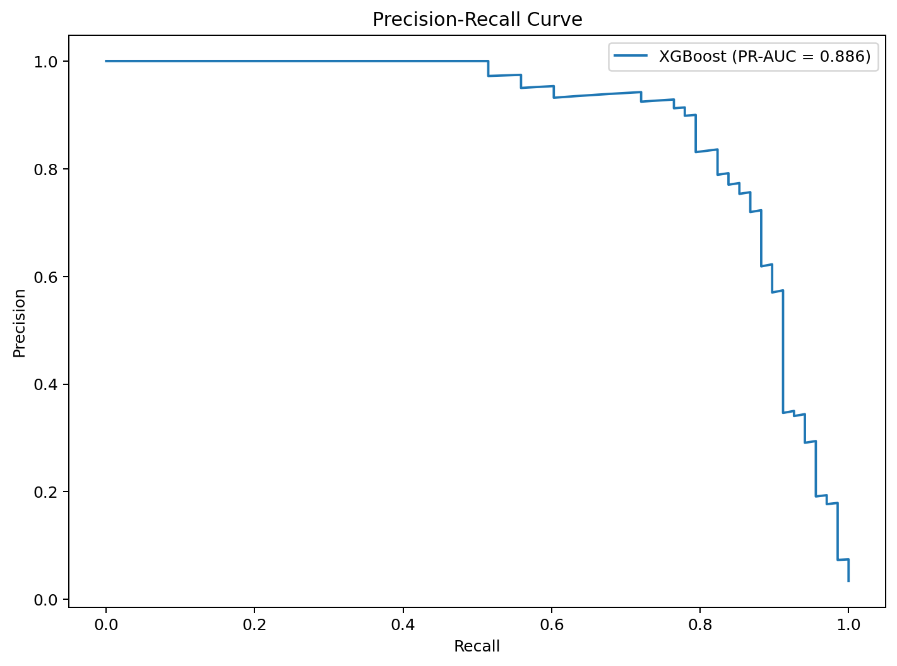

Because machine failure is the minority class, the Precision-Recall curve is especially useful for understanding failure detection performance.

**PR-AUC = 0.8856**

---

## Failure Probability

The model produces a probability of failure rather than only a hard `0/1` prediction.

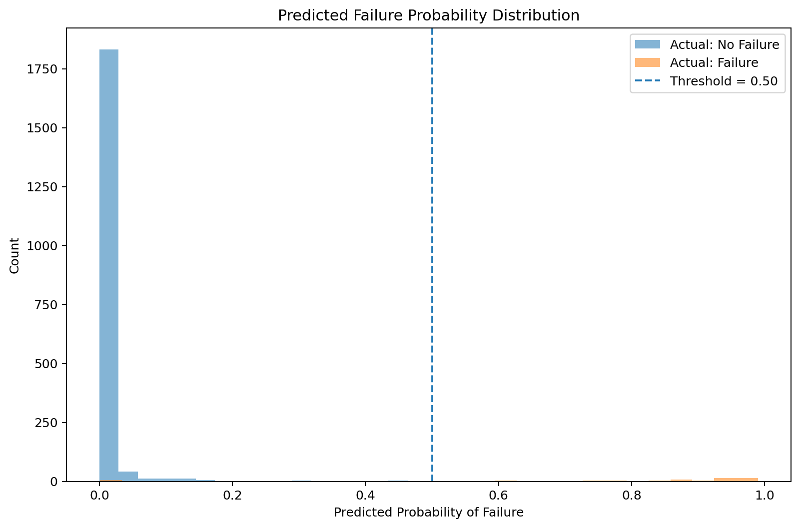

A default threshold of `0.50` converts probabilities into classes:

```text
Probability >= 0.50 → Failure
Probability <  0.50 → No Failure
```

The notebook also investigates how changing this threshold affects precision, recall and F1.

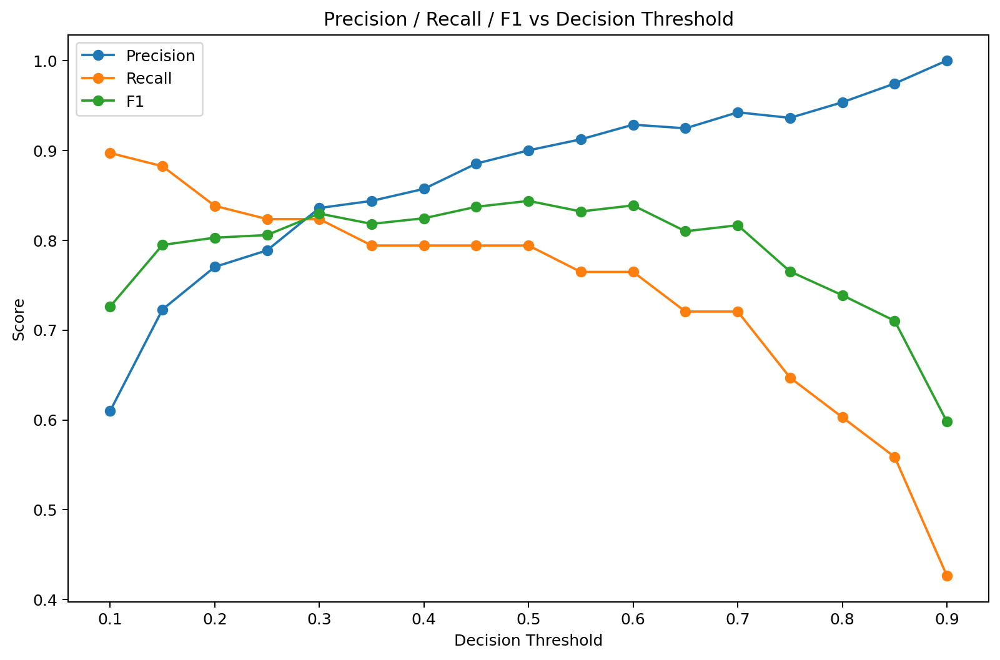

> The threshold analysis is intended to understand model behavior. For a strictly unbiased final evaluation, the operating threshold should be selected using validation data/CV and then applied once to the untouched test set.

---

## Feature Importance

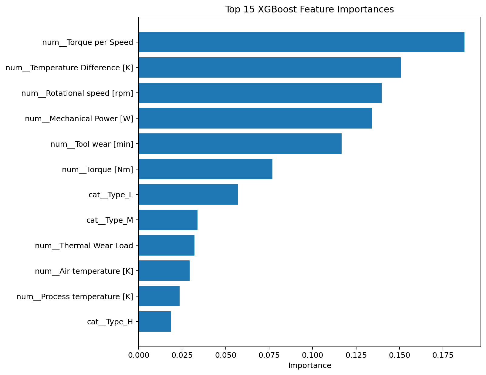

Feature importance provides an indication of which transformed input features XGBoost relied on most strongly.

Feature importance should be interpreted as model-specific importance, not as proof of causality.

---

## Important Modeling Note

This dataset supports **machine-failure classification/prediction from recorded operating conditions**.

It should not be described as a system that can precisely forecast something like:

> "The machine will fail exactly 10 minutes from now."

The target represents whether the observation is associated with machine failure. A real predictive-maintenance deployment would additionally require time-series structure, historical machine states, timestamps, and a clearly defined prediction horizon.

---

## Tech Stack

- Python
- Pandas
- NumPy
- Matplotlib
- Seaborn
- Scikit-learn
- XGBoost
- Jupyter Notebook

---

## How to Run

### 1. Clone the repository

```bash
git clone <your-repository-url>
cd AI4I-Predictive-Maintenance
```

### 2. Create a virtual environment

```bash
python -m venv .venv
```

Windows:

```bash
.venv\Scripts\activate
```

macOS/Linux:

```bash
source .venv/bin/activate
```

### 3. Install dependencies

```bash
pip install -r requirements.txt
```

### 4. Launch Jupyter

```bash
jupyter notebook
```

Open:

```text
Aditya_Machine_Failure.ipynb
```

## License / Dataset Attribution

The machine-learning code in this repository is provided for educational and project use.

The AI4I 2020 dataset is attributed to its original creators. Refer to the original Kaggle/UCI dataset pages for the dataset's licensing and attribution requirements.
